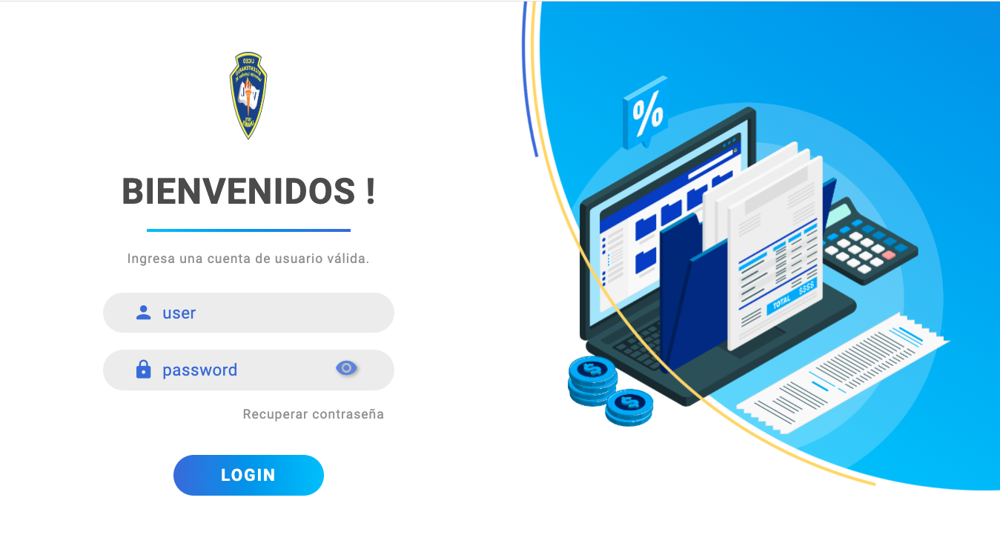

# Diseño login
Diseño de un login responsive para utilizar en el control de acceso de una aplicacion web.
El diseño cuenta con las siguiente características:
- Responsive
- Animaciones
- Estilos con css

<p align="center">
    
  &nbsp;
    
  &nbsp;
    
  &nbsp;
    
</p>




## Descarga y uso

Puedes descargar el proyecto clonando el repositorio e instalar las dependencias para poder modificarlos a gusto. Para ello, necesitas hacer lo siguiente:

- Clonar el repositorio

```
git clone https://github.com/svtech-code/front_login.git
```

- Acceder a la carpeta e instalar las dependencias con *npm*

```
cd front_login
npm install
```

- Inicializar el proyecto

```
npm run dev
```
