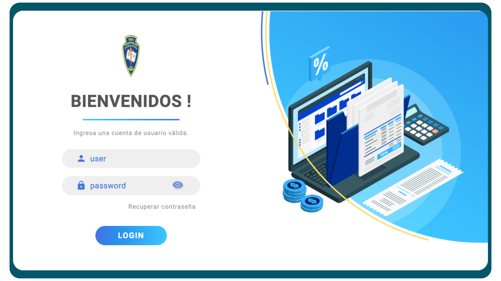

<p align="center">
  
</p>

<p align="center">
  <h1 align="center">Template Login</h1>
</p>

<div align="center">
  &nbsp;
  &nbsp;
  &nbsp;
  
  
</div>



## 📑 Descripción
Diseño de un template para un login responsive, que puede ser utilizado en el control de acceso de una aplicacion web.
El diseño cuenta con las siguientes características:
- Responsive
- Animaciones
- Estilos con css

<br>

## 🛠️ Stack
- [React](https://react.dev)
- CSS 3

<br>

## 💻 Uso del repositorio
Para utilizar este repositorio de manera funcional, debes considerar lo siguiente:

### 1. Clona el repositorio
```
git clone https://github.com/svtech-code/front_login.git
```

### 2. Accede al directorio del proyecto
```
cd front_login
```

### 3. Instala las dependencias
- Yo utilizo **npm**
```
npm run dev
```

### 4. Inicializa el proyecto
```
npm run dev
```
Luego de inicializar, abre tu navegador e ingresa al [http://localhost:5173](http://localhost:5173)

<br>

## ⚙️ Comandos
Alguno de los comandos más comunes para trabajar con el proyecto usando **npm**

|     |Comando           | Acción                                        |
| :-- | :--------------- | :-------------------------------------------- |
| 📦  |install           | Instalación de las dependencias del proyecto |
| 🏁  |run dev / star    | Inicializa un servidor de desarrollo local `localhost:5173` |
| 👨‍💻  |run build         | Comprueba errores y genera el empaquetado del proyecto `./dist/` |
| 🖥️  |run preview       | Vista previa del proyecto en local `localhost:5173` |
